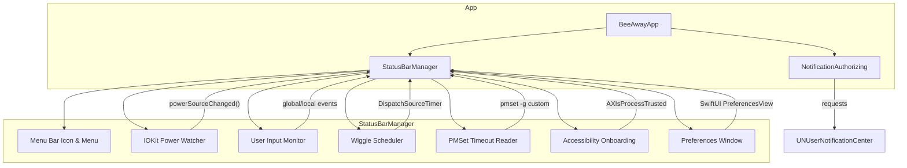
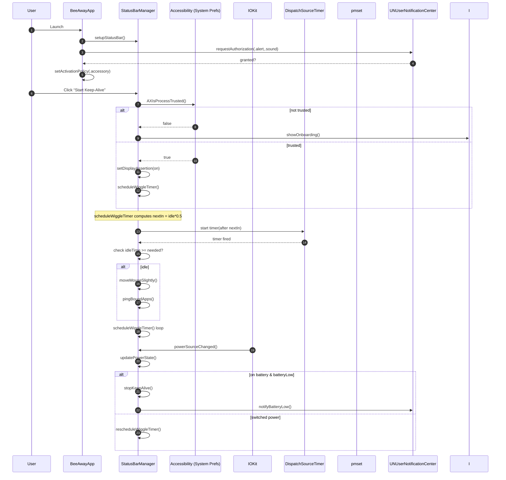
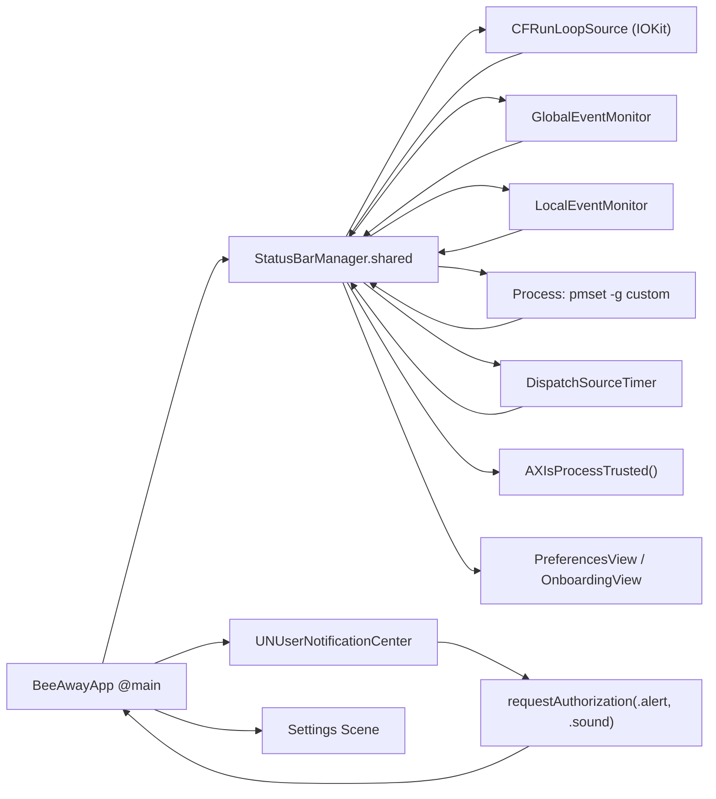
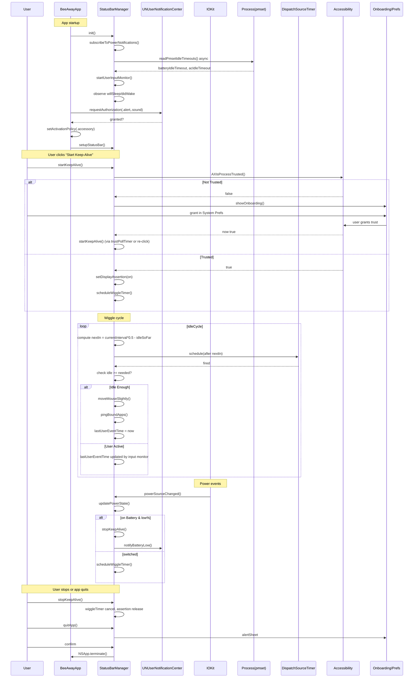

## BeeAway Flowchart

Please refer to the following diagrams for a high-level overview of the BeeAway app architecture and its components.

## Table of Contents
- [High Level Components Diagram](#high-level-components-diagram)
- [Detailed Sequence Diagram (Start Keep-Alive → Wiggle → Power Change)](#detailed-sequence-diagram-start-keep-alive--wiggle--power-change)
- [Component & Data‐Flow Diagram (high‐to‐low level)](#component--data-flow-diagram-high-to-low-level)
- [Deep Sequence Diagram (App Launch → Full Keep-Alive Lifecycle)](#deep-sequence-diagram-app-launch--full-keep-alive-lifecycle)

## High Level Components Diagram

## Detailed Sequence Diagram (Start Keep-Alive → Wiggle → Power Change)

## Component & Data‐Flow Diagram (high‐to‐low level)

## Deep Sequence Diagram (App Launch → Full Keep-Alive Lifecycle)

